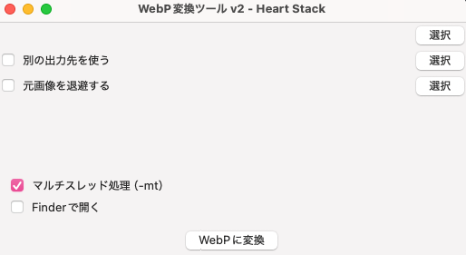

# 💖 HeartWebP - 画像一括変換GUIツール

**HeartWebP** は、画像を一括で `.webp` に変換するための GUI ツールです。
高画質・透過保持・マルチスレッド圧縮に対応し、
コマンド不要・ドラッグ＆ドロップでも動く、**クリエイター向け爆速変換ツール**です。



---

## ✨ 特徴

- ✅ `.jpg`, `.jpeg`, `.png` を一括で `.webp` に変換
- ✅ `-q`, `-alpha_q`, `-m`, `-mt` など詳細設定もGUIで操作
- ✅ **別フォルダへの出力**、**元画像の退避**が可能（階層保持）
- ✅ **Finder自動起動**や**ドラッグ＆ドロップ対応**（v2.1以降）
- ✅ macOS対応、Tkinterで簡単に起動可
- ✅ GUIでもCLIでも使える設計（今後対応）

---

## 🧪 開発背景
> Macに触れて間もなく、Winで使用していたwebp変換ソフトが使えないことに嘆いた。 
> 無料かつ背景透過対応で、画質も落とさず、理想通りの階層で出力できるソフトを見つけられなかった。変換前の画像も退避させたかった。 
> フォトショでいちいち保存してた私を救いたかった。コマンドすら打ちたくなかった。 
> だから私は GUI を作った（作者）

---

## 🚀 インストール & 実行方法（Mac）

### 🔧 前提：`webp` ライブラリを入れる

```bash
brew install webp
```

### ▶️ 起動方法（GUI）

```bash
python3 webp_gui.py
```

※ ファイル名は任意のものに置き換えてください。

---

## 📁 機能一覧

| 機能                     | 説明                                                                 |
|--------------------------|----------------------------------------------------------------------|
| 品質設定（-q）           | 出力画質を設定（推奨80〜90）                                         |
| 透過品質（-alpha_q）     | 透過部分の画質（推奨100）                                            |
| 圧縮メソッド（-m）       | 0〜6（高いほど圧縮率・時間↑）                                       |
| マルチスレッド（-mt）    | 高速変換ON/OFF                                                        |
| 出力先の指定             | 元とは別の出力フォルダへ保存可能                                    |
| 元画像の退避             | 階層保持したまま退避先に移動                                        |
| Finderで開く             | 変換後フォルダを自動で開く                                          |
| ドラッグ＆ドロップ対応   | v2.1で追加予定！                                                    |

---

## 📦 今後のアップデート予定

- ✅ **ドラッグ＆ドロップ対応**
- ✅ **CLI二刀流モード（引数指定で自動変換）**
- ✅ **私好みのUIテーマモード**
- ✅ **バッチ変換ログの保存機能**

---

## 🧑‍💻 作者

**as**  
[Heart Stack](https://github.com/a-suzuki8888) – フルスタックエンジニア ー


---

## 📝 ライセンス

MIT License
